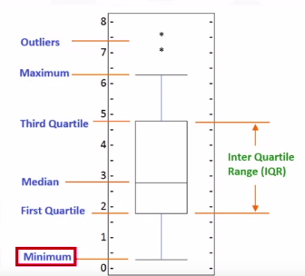

# Data Visualization with Python - Summary

## Author: Pablo Nunes

----

## Modules

1. In the first module, we will discuss data visualization and best practices when creating one. 
   - Learn about MatPlotLib
   - Learning how to interpret a dataset in hands-on sessions
   - A crash course in Pandas
2. In the second module, we will learn to use basic data visualizations.
   - Make area plots, histograms, and bar charts using MatPlotLib
   - Make more advanced visualizations with MatPlotLib like pie charts, box plots, scatter plots, and bubble plots.
3. In the last module, learn to use more specialized charts.
   - Learn to use waffle charts, word clouds and choropleth maps.
   - Explore Seaborn and Folium.

## Introduction to Data Visualization

- Why build visuals?
  - For exploratory data analysis
  - Communicate data clearly
  - Share unbiased representation of data
  - Support recommendations to different stakeholders
- Best practices
  1. Less is more effective
  2. Less is more attractive
  3. Less is more impacting

## Introduction to MatPlotLib

- The MatPlotLib architecture
  1. Backend Layer (FigureCanvas, Renderer, Event)
  2. Artist Layer (Artist)
  3. Scripting Layer (pyplot)
- Basic Plotting with MatPlotLib
  - MatPlotLib is very well supported
  - We going to use Jupyter Notebook
  - ```%matplotlib notebook``` can be used to plots update in real time
  - We can use Pandas with MatPlotLib, using ```.plot(kind="line")``` we have a plot with our dataframe and ```.plot(kind="hist")``` to have a histogram.
- Line Plot
  - A line plot is a type of plot which displays information as a series of datapoints connected by straight line segments.
  - The best case for a line plot, is when the data is a continuous dataset

## Basic Visualization Tools

- Area Plots
  - The Area plot is used to represent cumulated tools, using tools or percentages over time.
  - Is based on the line plot
  - Are stacked by default
  - Using ```.plot(kind='area')```
- Histograms
  - Is the frequency distribution representation of a variable
  - Using ```.plot(kind='area')``` or ```np.histogram(df)```
- Bar Charts
  - Used to compare the value of a variable at a given point in time
  - Using ```.plot(kind='bar')``` or ```.plot(kind='barh')``` for horizontal bars
- Pie Charts
  - Is a circular and statistical graphic divided by slices to show numerical proportion
  - Pie Chart is said to not show the information with any consistency.
- Box Plot
  - Plots statistically representing the distribution of tha data given five main dimensions.
  - For instance:

  

  - For each one:
    - Minimum: The lowest data point in a variable
    - First Quartile: 25% of the data is below this point
    - Median: The median of the data
    - Third Quartile: 75% of the data is below this point
    - Maximum: The highest point in the sorted data
- Scatter Plot
  - Is a plot which compares teo variables against each other.
  - Is useful to note correlations

## Advanced Visualization Tools

- Waffle Charts
  - Is a visualization created to display progress towards goals
  - Thus making a representation based on tiles, so the more the contribution, more tiles
  - MatPlotLib does not have native support for Waffle Charts
- Word Clouds
  - Is a depiction of the frequency of different words in some textual data
  - MatPlotLib does not have native support, but we can use other libs
- Seaborn and Regression plots
  - Seaborn is based on Matplotlib
  - It optimizes writing code comparing to MatPlotLib

## Visualizing Geospatial Data

- Folium
  - A powerful library that helps creating types of Leaflet maps
  - Enables binding of data to a map and passing visualization on the map
  - Maps in Folium are interactive
- Chorolopleth Maps
  - Chorolopleth Maps are maps, which areas are shaded or patterned in proportion to the measurement of a statistical variable
  - We can use Geojson
